**Linux Commands**

**Introduction:**

In AWS, especially when working with EC2 Linux instances, Linux commands are essential for managing and interacting with the virtual server environment. After connecting to a Linux instance via SSH, users use Linux commands to perform tasks like:

- Navigating directories (cd, ls)
- Managing files (cp, mv, rm, nano, vim)
- Installing software (yum, apt-get)
- Monitoring system performance (top, htop, df, free)
- Managing permissions and users (chmod, chown, adduser)
- Starting and stopping services (systemctl, service)
- Transferring files (scp, rsync)
- Running scripts and automating tasks (bash, cron)

These commands enable users to configure servers, deploy applications, manage storage, and handle system operations—all directly within the cloud environment.

**Step by Step Instructions:**

**Step 1:**

- Go to “AWS Management Console” and search “EC2”.

              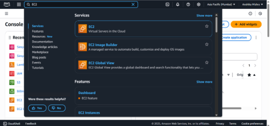

- The “EC2 Dashboard” will open.
- Go to “Instance”.
- Click on “Launch Instance”.

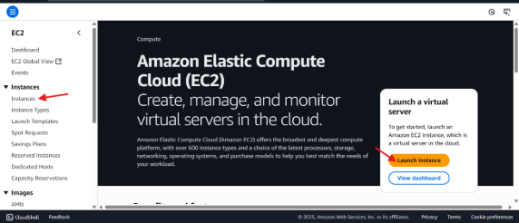

- Type Server name.

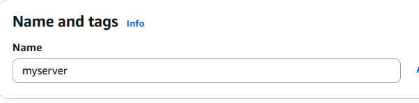

- Select “Amazon Linux aws”.  

  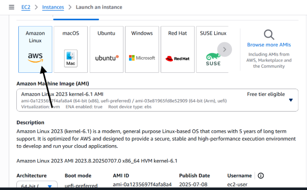

- Select “t2.micro” instance type.
- Select key pair.

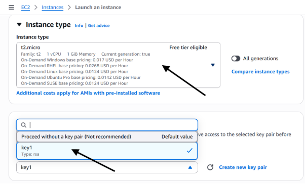

- In Network Setting, Allow https and https.

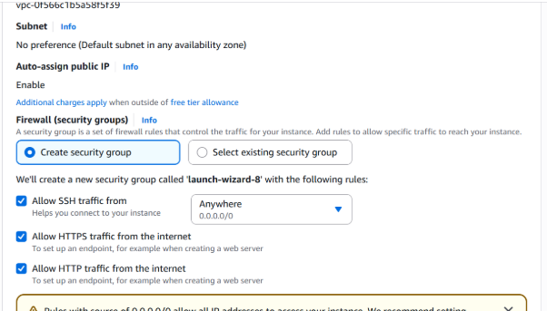

- Click on “Launch Instance”.
- 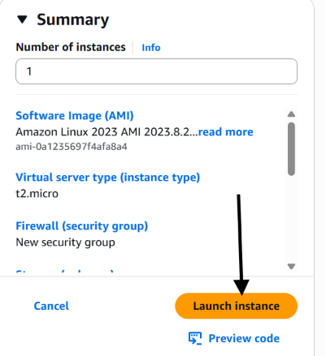
- Wait until the instance state goes from “Pending” to “Running”.

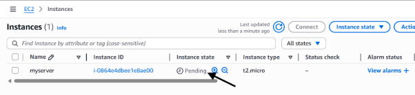

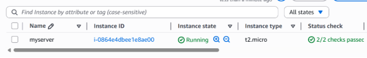

- Now, Select the server and then click on “Connect”.

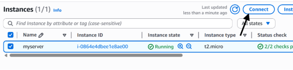

- Then click on connect.

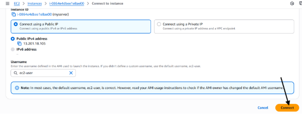

- Change user with the help of “sudo su” command.
- Then for check update type “yum update -y”.

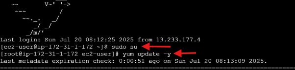

- For installation type “yum install httpd -y”

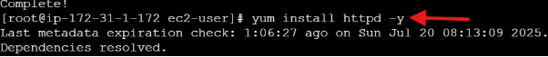

- Whether package is start or stop you have to type command “systemctl status httpd”.

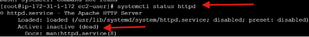

- It shows that “inactive(dead)”.
- For Starting package, type “systemctl start httpd”.

`      `

- For html, type command “cd /var/www/html”.

- For typing the text, type “cat >index.html” and then type the message, after this press “Ctrl+ D” for exit.

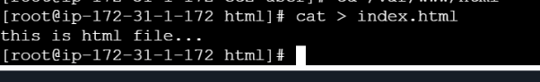

- For Creating file, “cat file1” or “cat > file1” and type something after this type “Ctrl+ D”.

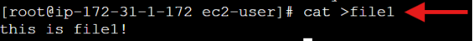

- For read, type “cat file1” command.

`            `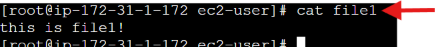

- For edit more line type “cat >> file1” command.

`          `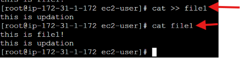 

- For creating multiples files, type “touch file{2..5}” command.
- For check file, type “ls” command.

  `   `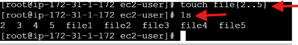

- For hidden file or dot file, type “ls-a” command. It stand for list all.

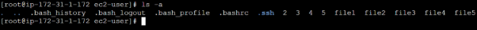

- For long list, type “ll” command.

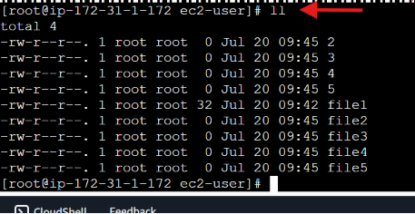

- In long list, for check hidden or dot file type “ll -a” command.

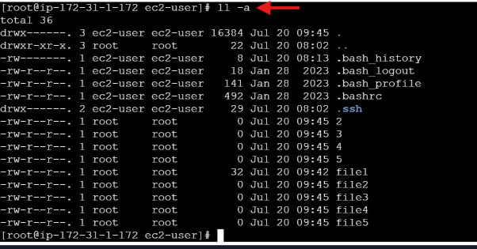

- For remove file, type “rm file2” command. It asks permission “remove regular empty file ‘file2’?” type “y”.

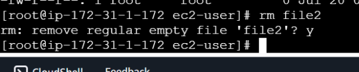

- If you don’t want permission to remove file type “rm -f file3” command. f stands for forcefully.

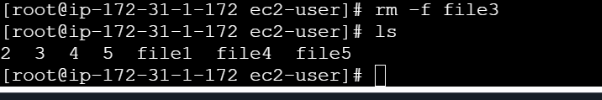

- For deleting internal files, type “rm -rvf file4” command. rvf stands for “recursive verbose forcefully” and it shows “removed”.

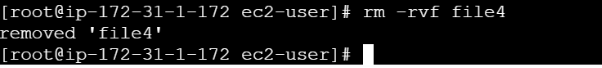

- For removing all files with the name of ‘file’, type “rm -rvf file\*”.

  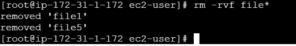

- For creating directory, type “mkdir my” command and then “my” name directory created.

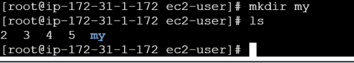

- For creating internal file in “my” type “mkdir my/abc” command.

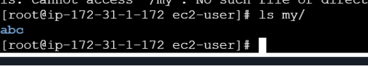

- For go to internal file of my, type “cd my/” command.

`               `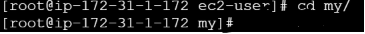

- For typing internal file type “cat > ql” command where ql is file.

  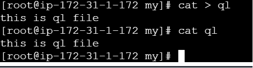

- For going one step back, type “cd ..” command.

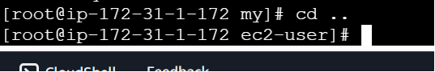

- Type “ll -a” command where you see those files which start from ‘d’ means ‘directory’ and ‘l’ means ‘list’ and ‘-‘ means ‘file’.

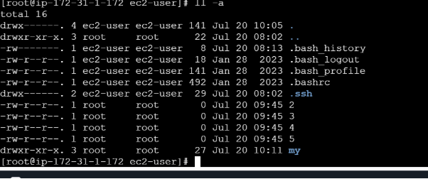

- For going to ‘block’, type “cd /dev/block” command.

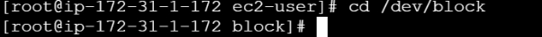

- For going to ‘bin’, type “cd ../../bin”.

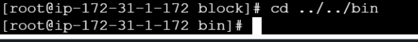

- If you forget your current location, type “pwd” command.

`          `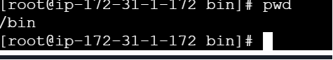

- For check list in, type “ls /bin” command.

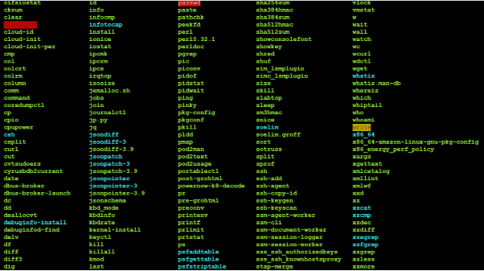

- For adding user, type “useradd user1” command where ‘user1’ is user name.

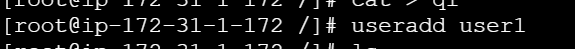

- For switching user, type “su user1” command.

`             `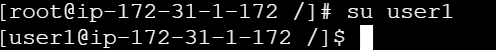

- **For update using vim:**
- Create file type “touch file1” command.
- For typing, type “cat >file1” command.
- For check, type “cat file1” command.
- For update, type “vim file1” command.

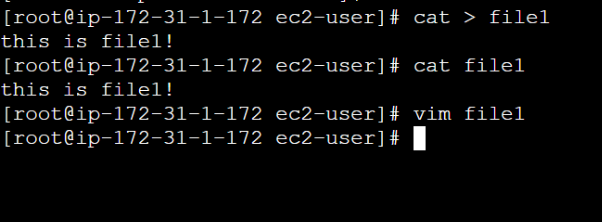

- For insert, type ‘i’ from keyboard.

`     `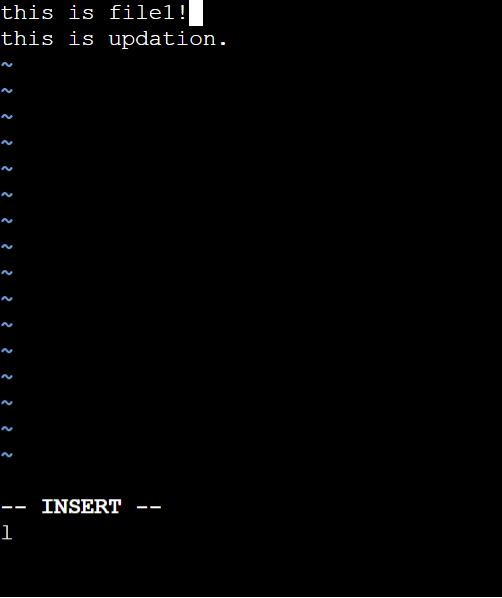

- For exit, click on ‘esc’ from keyboard.
- For save, type ‘:’.
- For write, type ‘w’ from keyboard.
- For quit, type ‘q’ from keyboard.

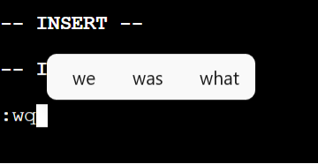

- Then see updated version.

**For changing file permission:**

- Only execution permission, type “chmod 111 file1” command. ‘x’ stands for ‘execute’.

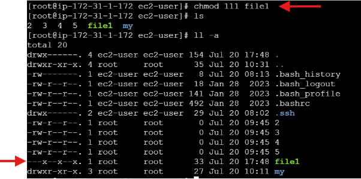

- Only write permission, type “chmod 222 file1” command. ‘w’ stands for ‘write’.

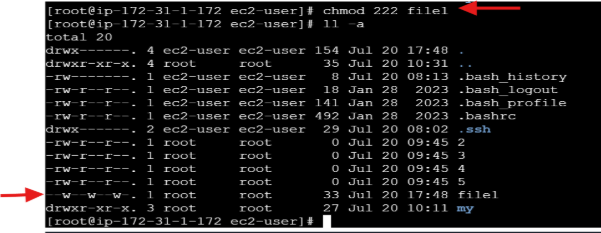

- Only read permission, type “chmod 444 file1” command. ‘r’ stands for ‘read’.

               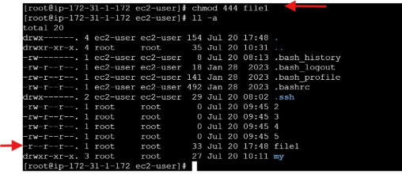

- Only all permission, type “chmod 777 file1” command. ‘rwx’ stands for ‘read write execution’.

- For copy, type file name with “cp”.
- For move, type file name with “mv”.
